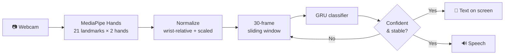
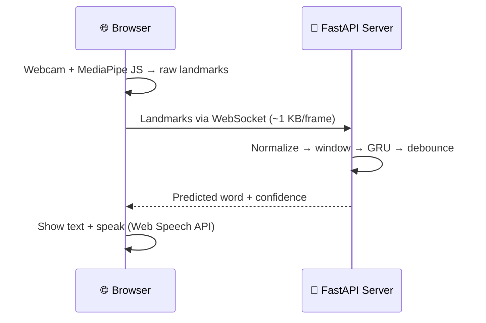
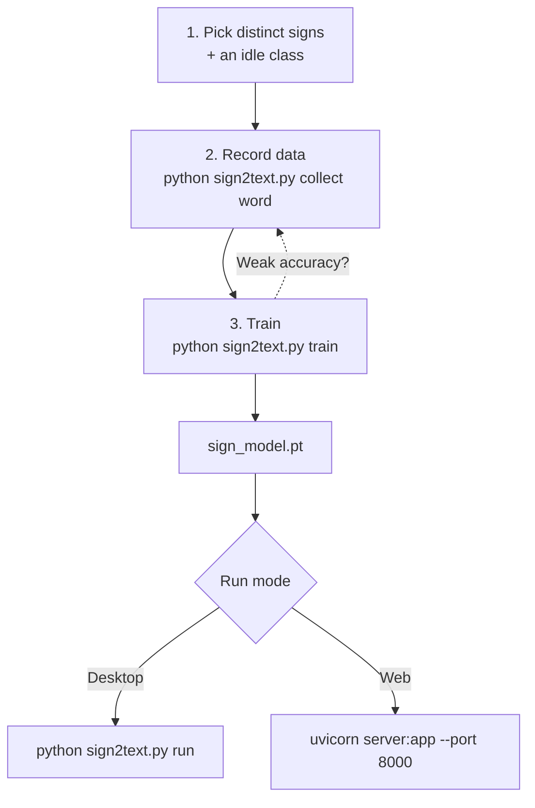

# 🤟 Sign Language to Text & Voice (Real Time)

> A webcam-only app that turns sign language gestures into **written text and spoken audio**, live, to help close the communication gap between people who sign and people who don't.

**Status:** Hackathon MVP. Recognizes a small vocabulary of isolated signs (5-10 words + an `idle` class). It is not a full sign language translator.


---

## ✨ Highlights

- **Real time:** runs on a normal CPU and webcam, no GPU needed
- **Privacy-friendly:** in web mode, video never leaves the browser; only hand landmarks (~1 KB/frame) are sent
- **Reads motion, not just poses:** a 30-frame window (~1 second) feeds a small GRU
- **Stable output:** confidence threshold + debounce + cooldown prevents flickering and repeated words
- **Two modes:** desktop (OpenCV) or browser (FastAPI + WebSocket)
- **Easy to extend:** add a new sign in two commands

---

## 🧠 How It Works



| Stage | What it does |
|---|---|
| **Hand tracking** | MediaPipe extracts 21 landmarks (x, y, z) per hand, up to 2 hands → 126 numbers per frame |
| **Normalization** | Landmarks become wrist-relative and scaled by hand size, so position and distance from the camera don't matter |
| **Windowing** | The last 30 frames go into the model, because many signs differ only in motion |
| **Debounce** | A word is emitted only if the same label wins with high confidence several times in a row, then a cooldown blocks repeats. `idle` never produces output |
| **Voice** | Text-to-speech runs off the video loop so the camera never stalls |

---

## 🏗️ Architecture (Web Mode)



---

## 🔁 Workflow: From Zero to Live Demo



---

## 🚀 Quick Start

**Requirements:** Python 3.10 or 3.11, a webcam. Web mode needs Chrome or Edge and internet on first load (MediaPipe files load from a CDN).

### 1. Install

```bash
python -m venv .venv
source .venv/bin/activate        # Windows: .venv\Scripts\activate

pip install mediapipe opencv-python numpy torch pyttsx3
pip install fastapi "uvicorn[standard]"   # web mode only
```

### 2. Record data

Choose signs that look clearly different (e.g. `hello`, `thank_you`, `yes`, `no`, `help`) from **one** sign language (ASL or ISL, don't mix). Always record an `idle` class too.

```bash
python sign2text.py collect hello
python sign2text.py collect thank_you
python sign2text.py collect yes
python sign2text.py collect no
python sign2text.py collect help
python sign2text.py collect idle
```

Each run records 40 samples (re-running appends more). For good accuracy:

- Aim for **40-60 samples per sign**
- Vary lighting, distance, posture, clothing and leading hand
- Record `idle` properly: resting hands, hands entering/leaving the frame, fidgeting
- **Get 2-3 other people to record**, the biggest boost to real-world accuracy

### 3. Train

```bash
python sign2text.py train      # trains on data/, prints validation accuracy, saves sign_model.pt
```

### 4. Run

```bash
# Desktop (press q to quit)
python sign2text.py run

# Web: then open http://localhost:8000 and allow camera access
uvicorn server:app --port 8000
```

---

## ➕ Adding a New Sign

```bash
python sign2text.py collect new_sign
python sign2text.py train
# restart the app / server
```

If it gets confused with another sign, record more varied samples of both or pick a more distinct sign.

---

## 📁 Project Structure

| File | Purpose |
|---|---|
| `sign2text.py` | Data collection, training and desktop live demo (`collect`, `train`, `run`) |
| `server.py` | FastAPI WebSocket server that serves the model to the browser |
| `index.html` | Browser frontend (webcam, landmark overlay, live text, voice) |
| `data/<word>/*.npy` | Recorded landmark sequences (created by `collect`) |
| `sign_model.pt` | Trained model (created by `train`) |

---

## ⚙️ Configuration

Set at the top of `sign2text.py`:

| Setting | Default | Effect |
|---|---|---|
| `SEQ_LEN` | 30 | Frames per gesture window (re-record and retrain if changed) |
| `CONF_THRESH` | 0.85 | Minimum confidence to accept a prediction |
| `STABLE_N` | 3 | Same label this many times in a row before emitting |
| `COOLDOWN` | 1.5 | Seconds before the same word can be spoken again |

---

## 🛠️ Troubleshooting

<details>
<summary><b>Wrong or no predictions</b></summary>

Check you have an `idle` class, enough varied samples, and distinct signs. Lower `CONF_THRESH` slightly if nothing fires; raise it if you get false triggers.
</details>

<details>
<summary><b>Works for me, fails for others</b></summary>

Your training data is too uniform. Add other people, lighting and distances.
</details>

<details>
<summary><b>Browser predictions look swapped vs desktop</b></summary>

Set `SWAP_HANDS = True` in `server.py`. Training and live input must use the same left/right convention.
</details>

<details>
<summary><b>Camera won't start in browser</b></summary>

Use `http://localhost:8000`, not an IP address (browsers block cameras on non-localhost HTTP). Also check the site's camera permission.
</details>

<details>
<summary><b>"server: reconnecting" on the web page</b></summary>

Make sure `uvicorn` is running and `sign_model.pt` exists (run `python sign2text.py train` first).
</details>

<details>
<summary><b>GPU error in browser</b></summary>

In `index.html`, change `delegate: "GPU"` to `delegate: "CPU"`.
</details>

<details>
<summary><b>Slow or failing first load offline</b></summary>

MediaPipe's wasm and hand model load from a CDN on first load. Download and serve them locally for an offline demo.
</details>

<details>
<summary><b>No voice on desktop</b></summary>

`pyttsx3` needs a system speech engine. On Linux, install `espeak`.
</details>

<details>
<summary><b>Using it from a phone or another computer</b></summary>

Cameras need HTTPS outside localhost. Use a tunnel (ngrok or Cloudflare Tunnel) and change the WebSocket URL in `index.html` from `ws://` to `wss://`.
</details>

---

## ⚠️ Known Limitations

- Isolated words from a small vocabulary only, no continuous sentences
- Hand landmarks only; real sign languages also use facial expression and body position
- Accuracy depends heavily on data variety. Single-session validation accuracy is optimistic, so test with someone not in your training data
- No fingerspelling support

---

## 🗺️ Roadmap

- [ ] Add face and pose landmarks (MediaPipe Holistic)
- [ ] Split train/validation by person or session for honest accuracy
- [ ] Train on a public dataset (e.g. WLASL, or an ISL dataset) for a larger vocabulary
- [ ] Add a language layer that turns word sequences into grammatical sentences
- [ ] Measure and optimize per-stage latency

---

## 👥 Team
Atharv Tyagi - 2392608033
Garv Agarwala - 2392608055
Deepraj Sharma - 2392608024
Dhairya Khandelwal - 2392608064
Chirag Maru - 2392608020
Vishwas Tiwari - 2392608160

## 🙏 Credits

Built with [MediaPipe](https://developers.google.com/mediapipe), [OpenCV](https://opencv.org/), [PyTorch](https://pytorch.org/), [FastAPI](https://fastapi.tiangolo.com/) and the Web Speech API.
